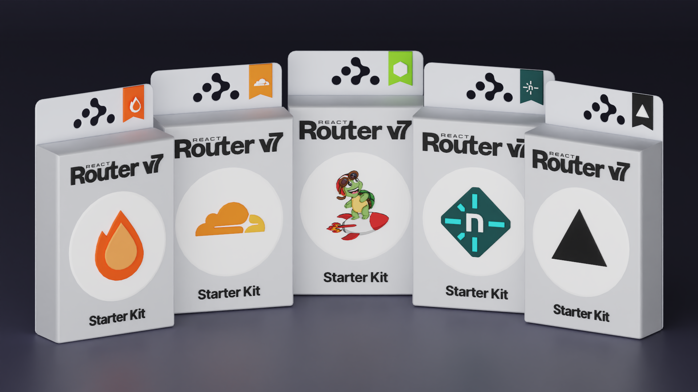

# React Bridging Templates



You can quickly create a new React Bridging application from any of these templates using the `create-react-bridging` CLI.

```bash
npx create-react-bridging@latest --template khulnasoft/react-bridging-templates/<template-name>
```
